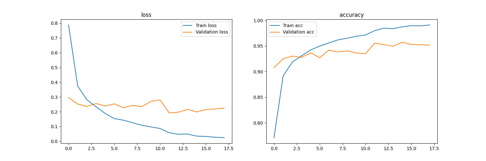
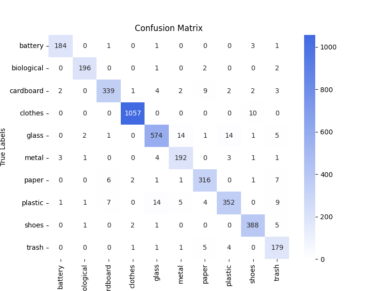
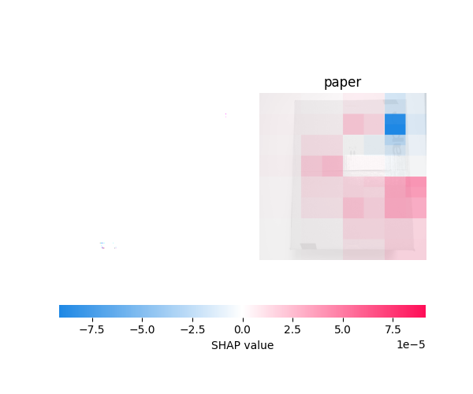
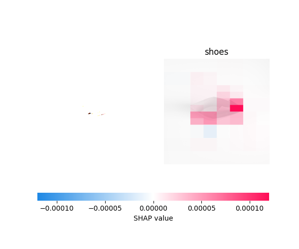
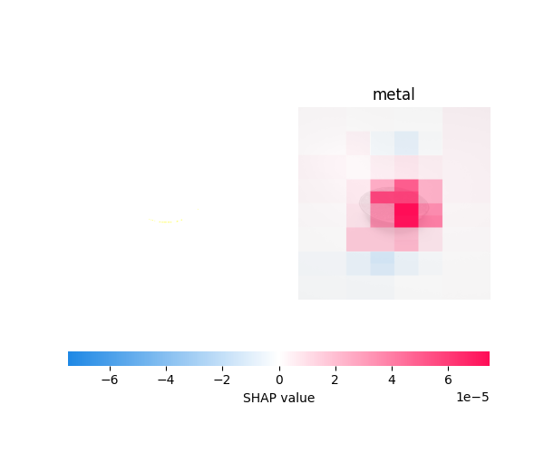

# ♻️ Waste Classification with Image Recognition

A Deep Learning Approach using ResNet and Transfer Learning

## 📌 **Project Summary**

This project presents a complete **end-to-end deep learning pipeline** for **automated waste classification**, built to support **smart recycling** and promote **sustainability**.

At its core is a modular, **two-stage image classification system** that uses a **Convolutional Neural Network (CNN)** architecture (ResNet50, pre-trained on ImageNet) to classify real-world waste images. The system includes both **backend and frontend components** for deployment and user interaction.

### **🧠** Two-Stage Classification System

The system is modular and built around a **two-stage image classification logic**:

- 🗑️ Primary Waste Classifier \
 Predicts one of **10 general waste categories**, including plastic, paper, metal, clothes, trash, and glass.

- 🍾 Glass Subclassifier
 Triggered **if the primary model predicts glass**, and refines the prediction into: brown, green, and transparent.

### 🧩 Modular Design Benefits

This architecture allows the system to:

- Scale easily to new waste categories or subtypes

- Offer both hierarchical prediction (auto-triggered) or direct subtype classification

- Serve predictions in real time via API for frontend integration or external use

### ♻️ AI for Sustainability

This project contributes to the broader goal of using AI for environmental impact by building automated waste classification systems. These models can enhance the efficiency of waste management systems, support smarter recycling initiatives, and reduce contamination in recycling streams.

### 🏷️ Support for Recycling Programs

By accurately classifying images into categories like plastic, glass, metal, or trash, the system can help power real-time sorting tools for **automated recycling facilities** or **smart waste bins**, enabling cleaner waste separation and more sustainable urban environments.

## 🎯 Purpose

This project was developed to:

- **Develop a deep learning model for automated waste recognition** using a labeled dataset of real-world garbage images.

- **Explore, clean, and understand** the dataset to uncover insights and ensure data quality.

- **Apply image preprocessing and data augmentation** techniques to boost model generalization and robustness.

- **Leverage transfer learning** with a ResNet-based architecture in TensorFlow to accelerate training and improve accuracy.

- **Address class imbalance** through the use of weighted loss functions, ensuring fair performance across all categories.

- **Ensure reproducibility** through a structured, step-by-step pipeline that can be easily replicated or extended.

Below is a precise breakdown of what each section of code does and how it works.

# 🗑️ Primary Waste Classifier Model

## 📘 Step-by-Step Notebook Walkthrough

### 🔍 1. Data Setup & Exploration**

**Acknowledgments/sources**: the code in our project is indebted to the notebook “Imbalanced Garbage Classification | ResNet50” by Farzad Nekouei, available at [https://www.kaggle.com/code/farzadnekouei/imbalanced-garbage-classification-resnet50](https://www.kaggle.com/code/farzadnekouei/imbalanced-garbage-classification-resnet50) and the accompanying code to the article “Managing Household Waste Through Transfer Learning” (Suman Kunwar, *Industrial and Domestic Waste Management (4:1), 14-22*, [https://tecnoscientifica.com/journal/idwm/article/view/408](https://tecnoscientifica.com/journal/idwm/article/view/408)). We use a slightly modified version of the dataset “Garbage Dataset” by Suman Kunwar, available at [https://www.kaggle.com/datasets/sumn2u/garbage-classification-v2](https://www.kaggle.com/datasets/sumn2u/garbage-classification-v2).

The notebook begins by loading the dataset, which is available on Kaggle.

***/kaggle/input/garbage-classification-v2/garbage-dataset***

The dataset is structured into subdirectories, where each subfolder corresponds to a specific waste category. It contains a total of **19,762 images** spread across **10 distinct classes** of garbage: **metal, glass, biological, paper, battery, trash, cardboard, shoes, clothes, and plastic.**

Each image is pre-labeled based on its folder name, making the dataset ready for supervised learning tasks. This hierarchical structure allows for easy loading and label inference using utilities like image_dataset_from_directory() in TensorFlow.

Using the os module, the code traverses the directory structure to automatically detect and list all available classes.

To perform an initial visual inspection of the data, the notebook uses a combination of PIL.Image (via from PIL import Image) and matplotlib.pyplot for rendering. For each class, a handful of images are randomly selected using random.sample() to assess image quality and consistency.

load_img() from Keras is also used for basic image loading and format inspection. These visualizations act as a quick sanity check to validate the structure and integrity of the dataset before moving into preprocessing and model training.

### 🧹 2. Data Cleaning & Validation

Before feeding the data into a deep learning model, the notebook performs essential cleaning steps to ensure consistency and quality across the dataset.

To verify that all images are usable, the code checks each file's dimensions—specifically the **width**, **height**, and **number of color channels**—using PIL.Image.open(). During this inspection, it was found that images vary significantly in size, with examples such as (263, 192, 3), (715, 500, 3), (451, 112, 3), and (1000, 750, 3). This variability highlights the need to resize all images to a consistent shape before training, as CNNs require uniform input dimensions.

If an image throws an error during Image.open(), it can be flagged as corrupted and removed. Although exception handling for this isn't explicitly shown in the current code, the logic can easily be extended to catch exceptions like UnidentifiedImageError.

The tensorflow model we use later only recognizes a certain subset of image files. Part of the code in this section reproduces the image directory from the input folder (which is read-only in kaggle notebooks) in the working directory (which is writable) and then applies checks to each of the images to ensure they conform to the later model’s requirements, removing all other images and reporting on its results.

Once validation is complete, the dataset is **reorganized into a clean working directory**. All valid images are copied into this new structure for downstream processing, while any unnecessary or incompatible files from the original directory are deleted. This ensures the model has access to only clean, consistent data throughout training.

### 🧾 3. Data Preprocessing

#### 📄 a. Creating a Structured Pandas DataFrame

The code loops through all categories and constructs a flat list of image file paths and their corresponding labels.

A Pandas DataFrame is created, where each row contains the image file path and its corresponding label, inferred from the folder structure.

This structured format (filepath, label) is ideal for manipulation, visualization, data splitting, and stratification in later steps. The resulting DataFrame is sampled using df.sample() to manually inspect entries.

**Batch Processing**: Instead of processing the entire dataset at once (which can be inefficient and memory-intensive), the data is divided into smaller chunks called *batches*. Setting batch_size = 64 means the model will process 64 images at a time before updating its weights.

#### 📊 b. Stratified Data Splitting & Class Balancing

To prepare the dataset for training, we used the splitfolders library to split the data into **training (70%)**, **validation (10%)**, and **test (20%)** subsets. This method performs a **stratified split** by preserving class distribution across all subsets, based on the original directory structure.

Each subset is stored in its own directory and loaded using TensorFlow’s image_dataset_from_directory(), which automatically infers labels from folder names and prepares the data in batches.

- **Training data** includes real-time data augmentation through the preprocess_train() pipeline.

- **Validation and test data** are processed using preprocess_val_test(), which applies resizing and normalization only.

We confirmed that the class distribution remains consistent across all subsets, helping ensure balanced model training.

To further mitigate class imbalance, **class weights** are computed and passed to the model during training. These weights ensure that underrepresented classes contribute proportionally to the loss function, promoting fairness across categories.

#### 🧪 c. Data Augmentation Pipeline

To improve the model's ability to generalize to unseen data, a custom **data augmentation pipeline** is built using **TensorFlow preprocessing layers** (tf.keras.layers). These transformations simulate real-world variability in image capture, such as orientation, lighting, and positioning.

The augmentation techniques applied include:

- **Random horizontal flipping** – mirrors images horizontally to simulate flipped perspectives

- **Random rotation** – introduces rotational variance for orientation robustness

- **Random zoom** – simulates distance variation in image capture

- **Random contrast and brightness adjustments** – helps the model handle lighting inconsistencies

- **Random translation** – mimics slight shifts or misalignments in object placement

These layers are defined inside a Sequential model and applied directly to the training dataset during batch loading, ensuring augmentations occur **on the fly** during training. This keeps the data pipeline efficient and avoids the need to store multiple augmented copies on disk.

#### 🖼️ d. Resizing & Normalization

To meet the input requirements of the ResNet architecture, all images are resized to **384×384 pixels**, ensuring consistent input dimensions for the model. Additionally, pixel values are **normalized from [0, 255] to [0, 1]** using a Rescaling(1./255) layer within TensorFlow’s preprocessing Sequential model.

Since normalization is already integrated into the preprocessing pipeline, there is no need to apply it manually or repeat it elsewhere. This streamlined approach ensures that the model consistently receives well-prepared, standardized input during both training and evaluation.

### 🔁 4. Dataset Pipeline with Tensorflow

The dataset pipeline is constructed using tf.keras.utils.image_dataset_from_directory(), which provides a convenient way to load and batch images directly from their directory structure. This function:

- **Infers labels** from folder names

- **Batches** images efficiently

- **Optionally shuffles** the dataset during loading

Preprocessing and augmentation layers are applied to each dataset using .map(), allowing them to run **on the fly** during training, without the need to store augmented images on disk.

The code loads and prepares three datasets:

- **Training dataset**: augmented using preprocess_train, which includes resizing, normalization, and data augmentation.

- **Validation and test datasets**: processed using preprocess_val_test, which applies only resizing and normalization to ensure consistent and fair evaluation.

Notably, the **test set is not shuffled**, preserving the original order of the images — this is important for reproducibility and for generating consistent predictions during evaluation or inference.

### 🏗️ 5. Model Building – Custom ResNet50

The model architecture is built using **transfer learning** with a pre-trained **ResNet50** as the base. The ResNet50 model is loaded with include_top=False to remove its original classification layers, and its weights are initialized from **ImageNet**.

To preserve the learned features during early training, the **base model is initially frozen**, preventing its weights from being updated.

A **custom classification head** is then added on top of the base, consisting of:

- GlobalAveragePooling2D() – to reduce the feature map dimensions

- Dropout(0.5) – for regularization and to prevent overfitting

- Dense(num_classes, activation='softmax') – for multi-class classification across 10 waste categories

The final model is compiled using:

- **Loss**: categorical_crossentropy

- **Optimizer**: Adam

- **Metric**: accuracy

To leverage the general visual features learned during pretraining, the **first 143 layers of ResNet50 are frozen**, preserving representations such as edges, textures, and shapes. The remaining layers are left **trainable** for fine-tuning on the waste classification dataset.

This results in:

- **8.6 million non-trainable parameters**

- **15 million trainable parameters**

### 🏋️ 6. Model Training with Callbacks

The model is trained over **50 epochs** using the previously compiled configuration. Several **callbacks** are integrated to optimize training and prevent overfitting:

- **ModelCheckpoint** – saves the best-performing model based on validation loss

- **EarlyStopping** – stops training if no improvement is observed over a set number of epochs

- **ReduceLROnPlateau** – lowers the learning rate dynamically when validation performance plateaus

Training is performed on the **augmented training dataset**, while validation is conducted on a clean dataset with only resizing and normalization. These strategies help the model generalize better and stabilize learning throughout the training process.

### 💾 7. Model Saving & Evaluation

After training, the final model is saved in .keras format for future reuse, fine-tuning, or deployment.

Model evaluation is performed on the **test set** to assess generalization performance. Predictions are generated in two steps:

1. **Class probabilities** are computed using model.predict()

2. These probabilities are converted into **discrete class labels** using np.argmax(..., axis=1), which selects the index of the highest probability for each sample.

A custom evaluation function, evaluate_model_performance(), is used to assess and visualize the model’s performance. This function:

- Generates a **classification report** using classification_report() from sklearn.metrics, including **precision**, **recall**, and **F1-score** for each class

- Computes and plots a **confusion matrix** using seaborn.heatmap() to visualize the distribution of correct vs. incorrect predictions

- Applies a **custom colormap** via LinearSegmentedColormap to improve the interpretability of the matrix

These evaluation steps provide a detailed understanding of how well the model performs across all 10 waste categories.

### 📊 8. Evaluation Outcomes

#### ✅ a. Key Performance Metrics

- **Overall Accuracy**: **96.5%** on the held-out test set of 3,954 samples

- **Loss**: Final test loss is **0.1763**

- **Recall**: Overall recall is **96.4%**, indicating strong sensitivity across most classes

- **Macro-Averaged F1-Score**: **95%**, reflecting balanced performance across all classes, regardless of class size

- **Weighted-Averaged F1-Score**: **96%**, accounting for class imbalance by giving more influence to high-frequency categories

#### 💪 b. Notable Strengths

- The model performs exceptionally well on **clothes**, the largest class, with **99% precision and recall**.

- High performance is also observed in **battery**, **biological**, **glass**, and **cardboard**, all achieving **95–98%** across precision, recall, and F1-score.

#### 🧠 c. Areas for potential improvement

**Metal**, **plastic**, and **trash** show **slightly lower F1-scores (89–93%)**, which may be due to:

- Visual similarity with other categories

- Less training data per class

These classes could benefit from **targeted data augmentation** or **class-specific fine-tuning**.

Although the model performs well on **glass** overall in the test metrics, **real-world tests revealed inconsistent predictions for glass items**. This suggests that the model may struggle with certain subtypes or variations of glass in practice.

## 🔁 Reproducibility Steps

To replicate this notebook:

To replicate this notebook:

1. **Clone the repository** or download the notebook.

2. **Download the original dataset** (e.g., from Kaggle) and place it in the appropriate raw input directory, e.g.: \
 /kaggle/input/garbage-classification-v2/garbage-dataset

3. **Run the notebook step-by-step**:

- Start with **data loading and validation**

- Use the splitfolders function to automatically split the dataset into **train**, **validation**, and **test** directories with stratified class distribution

- Proceed to **data preprocessing and augmentation

- Continue with **model building, training, and evaluation**

- *(Optional)* Tune hyperparameters

## 🔮 Making Predictions on New Images

To use the trained model for predicting a new image:

1. **Load the image** using PIL.Image.open() or tf.keras.utils.load_img().

2. **Resize** the image to 384×384 pixels (same size used during training).

3. **Convert to array** and **reshape** it to match the input shape: (1, 384, 384, 3).

4. **Normalize** pixel values to the [0, 1] range if not already handled.

5. **Call model.predict()** to obtain class probabilities.

6. Use np.argmax() to select the predicted class index.

### 🧰 Tech Stack

- **Language**: Python 3

- **Deep Learning**: TensorFlow, Keras, ResNet50 (CNN, transfer learning from ImageNet) \

- **Image Processing**: OpenCV, PIL, NumPy

- **Data Handling**: Pandas

- **Visualization**: Matplotlib

- **Dataset**: Garbage Classification Dataset (10 classes)

- **API Backend**: FastAPI – serves real-time predictions via HTTP

- **Web Frontend**: Streamlit – allows users to upload images and receive model predictions

- **Containerization**: Docker – ensures reproducibility across local and production environments

- **Deployment**: Compatible with cloud platforms (e.g., Render, Hugging Face Spaces, Railway)

💡 *For training and experimentation, it is recommended to run the notebook on ****Kaggle with GPU enabled**** (e.g., NVIDIA P100) to handle the computational load, especially during model fine-tuning.*

## 🚀 Future Improvements

- **Explore different fine-tuning strategies**, such as unfreezing more layers of ResNet50 or modifying the custom classification head

- **Expand the dataset**, particularly for underperforming categories like glass, metal, and trash

- **Apply class-targeted data augmentation** to address visual similarity and class imbalance

- **Further fine-tune the model** to improve generalization on visually ambiguous or overlapping classes

## 📈 Figures & Key Insights

### Figure 1 – Training History

*Validation accuracy stabilizes around 96%, showing strong generalization with minimal overfitting.**
*

### Figure 2 – Confusion Matrix

*Slight misclassifications between glass, plastic, and metal, but overall strong per-class performance.*

Shapley value estimation

We use Shapley value ([https://en.wikipedia.org/wiki/Shapley_value](https://en.wikipedia.org/wiki/Shapley_value)) estimation for image classification via the SHAP module ([https://shap.readthedocs.io/en/latest/image_examples.html#image-classification](https://shap.readthedocs.io/en/latest/image_examples.html#image-classification)) to assess the contribution of individual pictorial elements (“hyperpixels”) to the classification obtained by our model on exemplary images from a small test dataset created by ourselves. The intention is to gain insight on what contributes to wrong and right classifications, and from there on how to improve future versions of our model. We ran the Shapley value estimations with 400 evaluations per image.

### Figure 3 – SHAP Paper

This image of a cardboard box the model has misclassified as ‘paper’. The Shapley values indicate that overall the visual elements from the box’s surface contributed to this classification, as well as the straight righthand border. Interpretation is not easy here, however. For practical purposes, a confusion between ‘paper’ and ‘cardboard’ probably is not very relevant, since most waste recycling systems treat the two similarly anyway.

### Figure 4 – SHAP Shoes

For this picture, which is a piece of cardboard rolled up, we should get ‘cardboard’, but the model misclassifies as ‘shoes’. The positive Shapley values in red indicate that the right “tip” of the cardboard roll and the left bottom corner in particular contributed to this classification. It seems that the ‘shoe-like” shape of these elements could be responsible here, possibly suggesting that the model classifies cardboard based on stereotypically rectangular shape - which is not ideal for waste classification, since cardboard waste is often torn or twisted out of its original shape.

### Figure 5 – SHAP Metal

For this picture of a halved lime, the model gives the wrong classification of ‘metal’, when the correct class would have been ‘biological’. The Shapley values indicate that in particular the righthand part of the lime’s surface contribute to this classification. We can surmise that this is because of the reflections visible there, which the model might have taken to be indicative of a metal-like surface. Additional data augmentation with more varying light conditions as well as a larger dataset for the highly variable class of ‘biological’ waste might lead to improvement here.

###
# 🍾 Glass Color Classifier Model

This model specializes in classifying **glass waste** into three subcategories:
brown, green, and transparent.

It serves as the **second stage** in a **hierarchical classification system**:

- **Option 1**: A user uploads a known glass item for direct subtype classification

- **Option 2**: The **primary waste model** predicts the image as glass, triggering this model to refine the prediction
